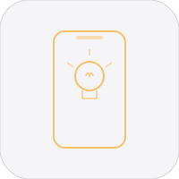
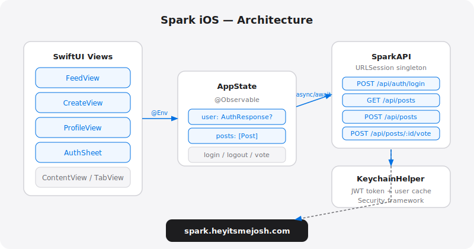

<div align="center">

# Spark iOS



Native iOS companion for [Spark](https://spark.heyitsmejosh.com) -- idea sharing with voting.

</div>

## Architecture



Portrait-only. Runs on iPhone.

## Stack

- SwiftUI, iOS 17+, Swift 6
- `@Observable` state management
- URLSession + async/await
- Keychain JWT storage
- Backend: Vercel serverless at `spark.heyitsmejosh.com`

## Features

- Browse posts with pull-to-refresh
- Upvote / downvote (auth required)
- Create posts with category picker
- Login / register in-app
- Profile: your posts, score, sign out
- Delete your own posts (swipe-to-delete)
- Search and filter posts by category
- JWT stored securely in Keychain

## Build

```bash
# Install xcodegen if needed
brew install xcodegen

cd ~/Documents/Code/spark-ios
xcodegen generate
open Spark.xcodeproj
```

Run on simulator or device via Xcode.

## API

Base: `https://spark.heyitsmejosh.com`

| Method | Path | Auth |
|--------|------|------|
| POST | /api/auth/login | no |
| POST | /api/auth/register | no |
| GET | /api/posts | no |
| POST | /api/posts | yes |
| POST | /api/posts/:id/vote | yes |
| DELETE | /api/posts/:id | yes |

## Roadmap

- [ ] Push notifications for votes
- [ ] Infinite scroll pagination
- [ ] Haptic feedback on votes
- [ ] Dark mode polish
- [ ] Deep links

## License

MIT 2026, Joshua Trommel

## Quick Commands
- `./scripts/simplify.sh` - normalize project structure
- `./scripts/monetize.sh . --write` - generate monetization plan (if available)
- `./scripts/audit.sh .` - run fast project audit (if available)
- `./scripts/ship.sh .` - run checks and ship (if available)
